# IOT_load_test_client
IOT_load_test_client
--------------------
Here is a Github page that details about a proposal for developing a performance load test tool for evaluating our IOT-MEC environment.

Reason:
--------
  To evaluate the latency introduced by the IOT-MEC environment and justify the value proposition that IOT on MEC provides to the enterprise users.
  To measure the performance of the IOT-MEC environment when it simultaneously handles thousands of IOT devices.
  To evaluate the various iPass solutions which are plugged into the IOT-MEC environment and that consumes, transforms and control the IOT end devices.
  To evaluate the processing delay introduced by various open source messaging queues which is the critical component of our IOT-MEC environment.
 
 Performance Parameters.
------------------------
  Latency is a time interval between the stimulation and response, or, from a more general point of view, a time delay between the cause and the effect of some physical change in the system being observed.

  From IOT perspective, Latency is the time taken between a stimulus (water leak or pressure drop from an IOT device) and a corrective response (turn off the water supply valve,send notification,...)

  Network latency in a packet-switched network is measured as either one-way (the time from the source sending a packet to the destination receiving it).

  Round-trip delay time (the one-way latency from source to destination plus the one-way latency from the destination back to the source). Round-trip latency is more often quoted, because it can be measured from a single point. Note that round trip latency excludes the amount of time that a destination system spends processing the packet.

Pros and Cons of purchasing a performance load test tool for evaluating IOT-MEC environment:
--------------------------------------------------------------------------------------------
  Pros - Perform faster evaluation of various iPass solutions and messaging queues.
  Pros - Spend more time on developing other components of IOT-MEC environment rather than developing a performance load test tool to evaluate IOT-MEC.
  Cons - Expensive. 
  Cons - Each vendor has their own proprietary tools and there is learning curve associated in getting to know how to fine tune the tool to our needs.
    
  Here are a list of MQTT performance load test vendors whom we evaluated for trial purpose. 
    Bevywise IoT Simulator
    MIMIC IOT Simulator.
      
  With both these simulators, we found that there is definitely a steep learning curve associated in using them and also they are not easily customizable to our IOT-MEC requirements.

Requirements:
-------------
The performance load test tool shall deliver the following requirements:

The performance load test tool shall be able to emulate/mimic thousands of IOT endpoints by authenticating and establish a secure connection with the IOT-MEC environment.
    
The performance load test tool shall be able to provide the following options to the end user:
  For the message producer instance:
   1. An option to choose the content of the IOT message 
   
   2. An option to choose how many instances of IOT end points should it emulate.
    
   3. Frequency in seconds which translates to the the number of message to be sent in one second to the IOT-MEC environment.
    
   4. Duration in seconds of the performance load test to be conducted.

   5. Unique queue identifier (a topic) where the message has to be published.
        
  For the message consumer instance:
   1. Unique queue identifier (a topic) to where this consumer should subscribe to and listen for messages.
    
   2. Duration in seconds of the performance load test to be conducted.

   3. Accurately measure (in milliseconds) the end-to-end latency introduced by the IOT-MEC environment for every IOT data that it produces and that get translated to an equivalent action from the IOT-MEC environment. For this, the following steps highlight how the end-to-end latency shall be computed by the performance load test tool.

       The message producer instance shall:
            1. Insert the current date and timestamp in microseconds into the original payload which informs when the message was published to the Unique queue identifier (a topic).

        IOT-MEC environment hosting the iPass solution shall 
          1. Consume the message published to the Unique queue identifier (a topic). 
          2. Produce a corresponding action (example: turn off a water valve,...) by publishing it to another Unique queue identifier (a topic).
          3. In this process, it makes sure to copy the original sender date and timestamp from the original payload to the corresponding action payload.
              
        The message consumer instance shall:
         1. Extract the date and timestamp from the message dequeued from the Unique queue identifier (a topic) and compare it with the current date and timestamp to compute the end-to-end latency.
          
         2. After having computed the latency, the message consumer instance shall publish this information to a non volatile memory which can be further extracted, transformed and loaded into more meaningful visual graphical plots.
         
   4. The performance test tool should provide a plug-in factory interface for developers to plug different flavors of message queue clients into the test environment and be able to use the tool to initiate the load test towards those newly developed messaging queue brokers.
	In other words, here is how the test environment should look like.
	
	
   5. Each publisher instance must be capable of sending 1000 messages per second or publish 1 message every 1 millisecond.
   6. Each subscriber instance must be capable of handling 1000 messages per second or 1 message every millisecond.
   7. All the instances shown above must be able to automatically configure themselves based upon the OS environment variables which could be modified dynamically via a yaml file (Kubernetes or Docker swarm).
   8. When there are hundreds of publisher instances, each of them must advertise their unique message queue topic to a database.
   9. There will be a corresponding consumer instance (1-1 mapping between producer-consumer) which shall pick an available producer topic and shall start consuming messages from that topic.
   10. Each consumer instance shall publish the computed latency values into a database indexed by the messaging queue topic name as the key.
   11. There will be a plotter instance which shall read the database for the published latency_topic_keys and shall get all the latencies per second and feed it to ELK or prometheus client to graphically plot the values.
   12. The producer, consumer and plotter instances should be able to be scaled up-down dynamically via a YAML file (kubernetes or docker-swarm).

Evaluation of open source languages and tools for delivering the expected performance load test requirements:
-------------------------------------------------------------------------------------------------------------
	 In order to scale to hundreds and thousands of producer and consumer instances, a highly resilient micro service architecture is desired.
	 
 	Producer and consumer instances shall be developed as a docker container which can be scaled to the desired limits at run time.
	
 	The open source ELK (Elastic search, Logstash and Kibana visual boards) shall be used to depict the computed latency in visual graphical format.
	
   	A real IOT end device shall send a maximum of 1000 message per second (one message every millisecond). 
	
   	In order to satisfy this requirement, any high level language shall be used for development. 
	
   	It is observed that PYTHON is the easiest and the developer friendly language that can also generate a thousand IOT messages per second.
	
   	You really don't need a compiled in language (C,C++) for development where a simple interpreter language (shell programming, python) shall fit the requirement.
	
    Python provides rich options to import various plug in modules (MQTT, Kafka, ELK, Docker,....) to get the desired job done at a faster development speed.

Goals:
------
 We plan to evaluate the following options for Messaging system that could be incorporated into our MEC-IOT environment:
 
      	RabbitMQ
	
      	Kafka
	
      	ZeroMQ
	
      	NATS
	
      	Pulsar
	
	EMQ
	
 We plan to evaluate the following iPass solutions that could be incorporated into our MEC-IOT environment.
 	
	Snaplogic
	
      	Losant
	
      	Kafka Streams.
      
A working prototype of a Performance Load test tool for IOT-MEC:
----------------------------------------------------------------
Here is the source code that is still work in progress that demonstrates a possible solution for a performance load test tool for IOT-MEC.

1. git clone https://github.com/ssriram1978/IOT_load_test_client.git

2. There are 4 sub directories or packages inside the cloned repository.

		a. publisher - This package contains the publisher script that produces payloads into the configured topics at the configured broker.
		The unit_test directory contains the unit test script that validates publisher code.
		
		b. subscriber - This package contains the subscriber script that subscribes to a configured topic at the configured broker and computes the end-to-end latency.
		
		The unit_test directory contains the unit test script that validates subscriber code.
		
		c. plotter - This package contains the code for talking to the configured graphical plotter (ELK or prometheus clients).
		
		d. infrastructure_components - This package contains the common packages used by the end users (publisher, subscriber and plotter packages).
		
			1. portainer_data  - Persistant volume mounted into the portainer docker for storing the login credentials.
			2. publisher_subscriber - The factory model that abstracts the actual broker client code from the end users (producer and subscriber packages).
			
			The unit_test directory contains the unit test script that validates publisher_subscriber factory interface.
			3. redis_client: The redis client interface that abstracts the actual redis client API calls to the end users (producer and subscriber packages)
			
			The unit_test directory contains the unit test script that validates redis interface.

3. There is a make_deploy.sh shell script.
usage: ./make_deploy.sh
<build <all|directory_name> <yaml file> <tag -- optional> > |
<deploy <yaml file> > |
<build_and_deploy <all|directory_name> <yaml file> <tag --optional>> | 
stop
prune
monitor start|stop

4. In order to run ELK, do the following:

./make_deploy.sh monitor start

This command will bring up ELK stack. Note that you do not need to run ELK stack on the same host where you perform the load testing.

Use this command to check if ELK stack is up and running. watch -n 1 curl 'localhost:9200/_cat/indices?v'

5. In order to run the load test, do the following:

Filebeat container is used to ship the local container logs to local or remote ELK host.
Edit the plotter/filebeat/filebeat.docker.yml and change the host: line to point filebeat to the remote host where ELK is running.
...
output.logstash:
        hosts: ["10.211.55.3:5044"]

./make_deploy.sh build_and_deploy all docker-stack-rabbitmq.yml
	This command will build docker images of all directories and deploy the containers specified in docker-stack-rabbitmq.yml and docker-stack-common.yml files.

./make_deploy.sh build all docker-stack-infrastructure.yml ssriram1978
This command will build docker images of producer, consumer, plotter and transformer directories and will also build Logstash with GROK filter plugin and tag the docker images with the passed in tag and push it to docker hub registry.

6. Kibana Port number is 5601. Open web browser and go to ip-address-of-elk:5601 to view Kibana dashboard.

7. Redis command per port is 8082: Open web browser and go to ip-address-of-load-test:8082 to view Redis dashboard.

8. Portainer port is 9000: Open web browser and go to ip-address-of-load-test:9000 to view Portainer dashboard.

9. The list of services and their respective configuration details.

	a. rabbitmq – creates a rabbitmq container.
	
	b. publisher – creates a publisher container. (deploy section can be modified to create as many replicas that you need).
	
	c.subscriber – creates a consumer container. (deploy section can be modified to create as many replicas that you need).
	
	d. redis – creates a redis server in a container.
	
	e. redis-commander: creates a container that provides a redis web interface for redis.
	
	f. portainer -- creates a container to provide a web interface to inspect the docker swarm and stacks.
	
	g. filebeat – creates a container to route all the container logs to logstash container.
	
	h. logstash – creates a container to handle all the docker logs.
	
	i. kibana – creates a container to handle the web interface to access the ELK stack.
	
	j. elasticsearch – creates a container to handle the elastic search of all the logstash.
	
Strategy to evaluate various message queues:
--------------------------------------------
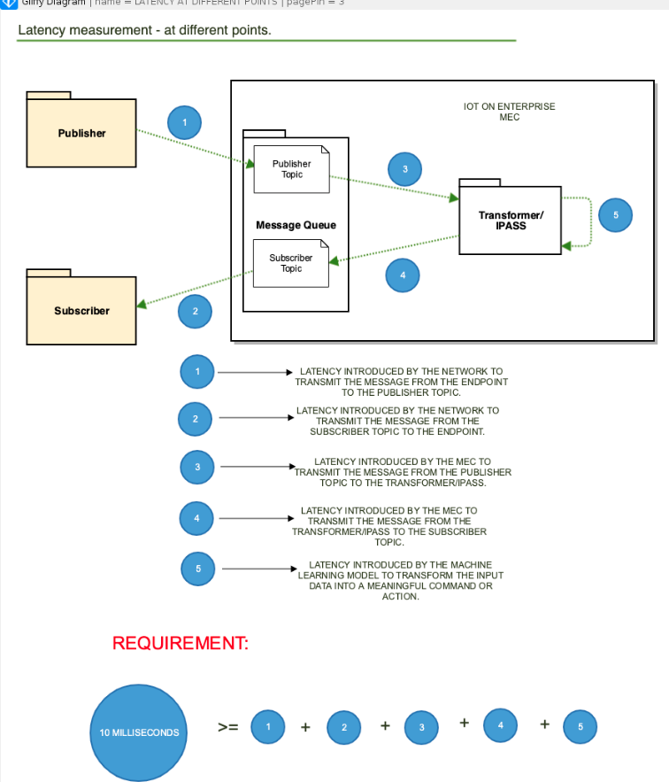

Run load test via kubernetes:
-----------------------------
	1. git clone https://github.com/ssriram1978/IOT_load_test_client.git
	
	2. cd git/IOT_load_test
	
	3. Install Docker and Kubernetes Master or worker by running this script.
	./install_uninstall.sh usage: ./install_uninstall.sh <install_docker|uninstall_docker|install_kubernetes|uninstall_kubernetes|install_kompose|kompose_convert>

	4. ./make_deploy.sh <deploy_infrastructure|undeploy_infrastructure> – Deploy/Undeploy Filebeat as a DeamonSet, Kubernetes Dashboard and creates namespace "common-infrastructure".
   
	5. ./make_deploy.sh deploy_infrastructure
	kubectl apply -f kubernetes_yaml_files/common_components/
	daemonset.extensions/filebeat configured
	configmap/filebeat-config configured
	configmap/filebeat-inputs configured
	clusterrole.rbac.authorization.k8s.io/filebeat configured
	clusterrolebinding.rbac.authorization.k8s.io/filebeat configured
	serviceaccount/filebeat configured
	serviceaccount/kubernetes-dashboard configured
	clusterrolebinding.rbac.authorization.k8s.io/kubernetes-dashboard configured
	deployment.extensions/kubernetes-dashboard configured
	service/kubernetes-dashboard configured
	namespace/common-infrastructure configured

	6. ./make_deploy.sh <deploy_elk|undeploy_elk> - Deploy Elasticsearch, Logsearch, Kibana in "elk" namespace.
	delete_logstash_index - Deleting all logstash indexes in the node to clear up space.
	
	./make_deploy.sh delete_logstash_index 
	curl \'localhost:30011/_cat/indices?v\' 
	health status index uuid pri rep docs.count docs.deleted store.size pri.store.size 
	green open .kibana Fs1yUY8EQNqdyiXdQ46J8w 1 0 2 0 11.8kb 11.8kb 
	yellow open logstash-2019.06.13 KaCbGRKST9mHwsvdYP8_2w 5 1 19050045 0 2gb 2gb 
	yellow open logstash-2019.06.14 4-NYBYH6SxCPoBXYRS8fCQ 5 1 29432130 0 3.8gb 3.8gb 
	yellow open {sss1234} hr-irUQPRXKPw1lhEfpjhA 5 1 48482250 0 6.7gb 6.7gb 
	curl -XDELETE 'localhost:30011/*

	deploy_prometheus_grafana|undeploy_prometheus_grafana - Deploy|Undeploy Prometheus and Grafana in "monitoring" namespace. Prometheus-node-exporter runs as deamonset in all the nodes.
	
	kubectl get svc -n monitoring NAME TYPE CLUSTER-IP EXTERNAL-IP PORT(S) AGE 
	alertmanager NodePort 10.100.44.179 <none> 9093:30268/TCP 67s 
	grafana NodePort 10.99.122.71 <none> 3000:30580/TCP 67s 
	kube-state-metrics ClusterIP 10.101.180.78 <none> 8080/TCP 67s 
	prometheus NodePort 10.105.50.214 <none> 9090:31905/TCP 67s 
	prometheus-node-exporter ClusterIP None <none> 9100/TCP 67s
	
	Set Prometheus as data source and IP as http://localhost:31905 in Grafana.

Load Test results:
------------------
Apache Kafka Broker + SNAPLOGIC  (100k messages per second)
-----------------------------------------------------------
Test Setup:
1. Apache Kafka - on "Broker" Node.

2. Topic: "PUBLISHER" and "SUBSCRIBER" each with 100 partitions.

3. 100 PUBLISHER PODS publishing 1000 messages per second to PUBLISHER topic.

4. 100 CONSUMER PODS belonging to one consumer group and subscribe to "SUBSCRIBER" topic.

		./make_deploy.sh deploy_core apache-kafka 
		kubectl apply -f kubernetes_yaml_files/core_components/kafka/apache 
		poddisruptionbudget.policy/kafka-pdb created service/kafka created 
		statefulset.apps/kafka created namespace/loadtest created 
		deployment.extensions/orchestrator created deployment.extensions/publisher created 
		deployment.extensions/redis-commander created service/redis-commander created 
		deployment.extensions/redis created service/redis created 
		deployment.extensions/subscriber created 
		deployment.extensions/transformer created 
		service/zookeeper created poddisruptionbudget.policy/zk-pdb created 
		statefulset.apps/zookeeper created

5. We tried to evaluate SNAPLOGIC vs CAMEL PODS which act as "Transformer" PODS. These PODS consume message from the "PUBLISHER" topic and produce transformed message to the "SUBSCRIBER" topic.

6. order to evaluate SNAPLOGIC, we had to stick to one KAFKA topic for PUBLISHER and one KAFKA topic for SUBSCRIBER and create 100 partitions to distribute the work load across 100 PUBLISHER and 100 CONSUMER PODS.

change_kafka_partition <topic_name> <partition_count> - Dynamically increase Kafka partition size. Used while testing Kafka Broker.

	./make_deploy.sh change_kafka_partition SUBSCRIBER 100
	Before:
	kubectl exec kafka-0 -n common-infrastructure -it -- /bin/bash ./opt/kafka_2.11-0.10.2.1/bin/kafka-topics.sh --describe --topic SUBSCRIBER --zookeeper zookeeper.common-infrastructure.svc.cluster.local:2181
	Topic:SUBSCRIBER PartitionCount:1 ReplicationFactor:1 Configs:
	Topic: SUBSCRIBER Partition: 0 Leader: 0 Replicas: 0 Isr: 0
	kubectl exec kafka-0 -n common-infrastructure -it -- /bin/bash ./opt/kafka_2.11-0.10.2.1/bin/kafka-topics.sh --alter --partitions 10  --topic SUBSCRIBER --zookeeper zookeeper.common-infrastructure.svc.cluster.local:2181
	WARNING: If partitions are increased for a topic that has a key, the partition logic or ordering of the messages will be affected
	Adding partitions succeeded!
	After:
	kubectl exec kafka-0 -n common-infrastructure -it -- /bin/bash ./opt/kafka_2.11-0.10.2.1/bin/kafka-topics.sh --describe --topic SUBSCRIBER --zookeeper zookeeper.common-infrastructure.svc.cluster.local:2181
	Topic:SUBSCRIBER PartitionCount:10 ReplicationFactor:1 Configs:
	Topic: SUBSCRIBER Partition: 0 Leader: 0 Replicas: 0 Isr: 0
	Topic: SUBSCRIBER Partition: 1 Leader: 0 Replicas: 0 Isr: 0
	Topic: SUBSCRIBER Partition: 2 Leader: 0 Replicas: 0 Isr: 0
	Topic: SUBSCRIBER Partition: 3 Leader: 0 Replicas: 0 Isr: 0
	Topic: SUBSCRIBER Partition: 4 Leader: 0 Replicas: 0 Isr: 0
	...
	...
	Do the same thing for PUBLISHER topic.

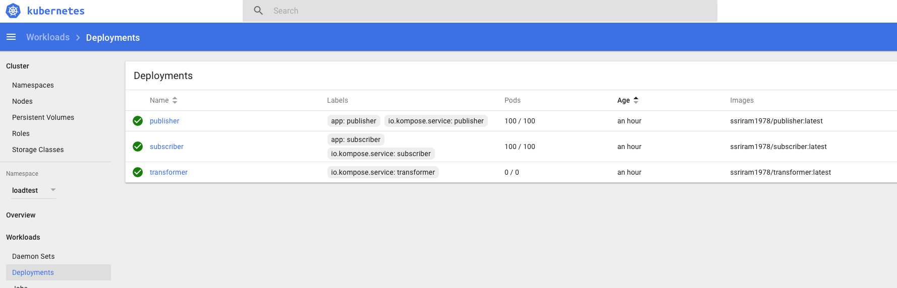

Latency results viewed in REDIS Database via REDIS COMMANDER: 

View the graphical plot of Latency in milliseconds vs the original timestamp when the message was sent by the PUBLISHER pod.

ELK stack consolidates all these 100,000 latency points and plots it graphically over the original timestamp embedded in the message sent by the PUBLISHER pod.

This end-to-end latency is computed by the SUBSCRIBER pod by computing the difference between the originally sent timestamp which is found embedded in the message and the current timestamp when the message was actually decoded and processed by the SUBSCRIBER pod.

KAFKA host CPU and RAM utilization:
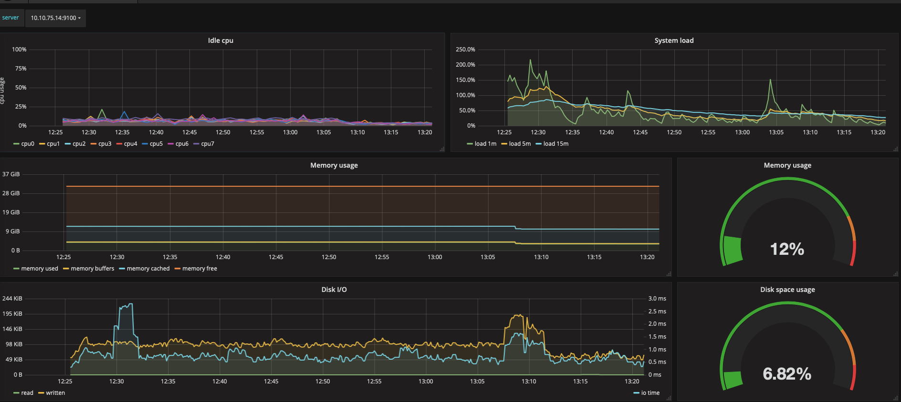

	Undeploy Kafka + SNAPLOGIC:
	./make_deploy.sh undeploy_core apache-kafka
	kubectl delete -f kubernetes_yaml_files/core_components/kafka/apache
	poddisruptionbudget.policy "kafka-pdb" deleted
	service "kafka" deleted
	statefulset.apps "kafka" deleted
	namespace "loadtest" deleted
	deployment.extensions "orchestrator" deleted
	deployment.extensions "publisher" deleted
	deployment.extensions "redis-commander" deleted
	service "redis-commander" deleted
	deployment.extensions "redis" deleted
	service "redis" deleted
	deployment.extensions "subscriber" deleted
	deployment.extensions "transformer" deleted
	service "zookeeper" deleted
	poddisruptionbudget.policy "zk-pdb" deleted
	statefulset.apps "zookeeper" deleted

	INFERENCE:
	----------
	1. SNAPLOGIC + KAFKA performs well and we can achieve millisecond end-to-end latency with this.
	
	2. are observing that the thruput is not 100k because the host CPU for PUBLISHER and SUBSCRIBER pods is running hot (as seen on the above pics). This causes a lot of context switch to happen between the PODS and results in lesser thruput of messages at higher loads.
	
	3. We can overcome this problem by re-architecting the PUBLISHER and SUBSCRIBER pods with more CPU and RAM but we don't have enough RAM and CPU available on the Basking Ridge MEC.
	
	4. Note that this result is obtained from one Kafka Broker. But, with proper clustering of KAFKA brokers, and with proper load distribution across KAFKA brokers, it is possible to achieve 100K messages per second thruput with single digit millisecond latency.

Apache Kafka + CAMEL (100k messages per second):
------------------------------------------------
 Latency Results(Redis):

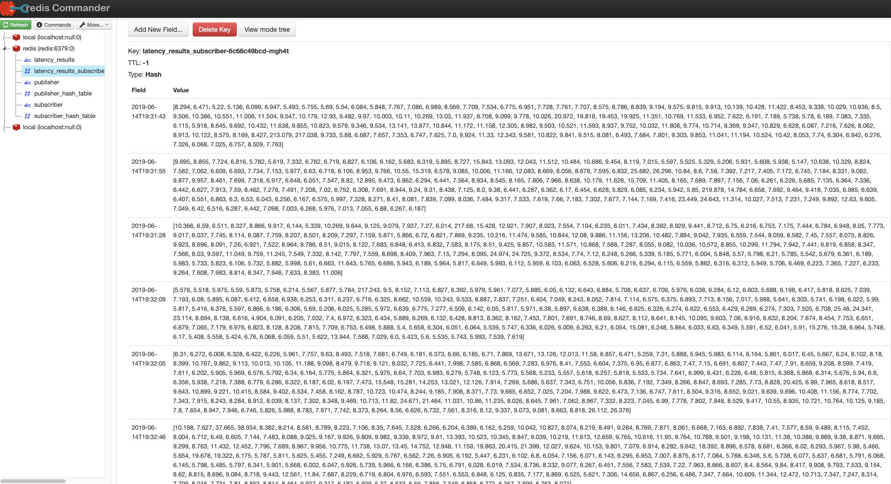

Latency Results: (ELK)
 
 
	Increasing the partition count to 10 per kafka topic:

 	./make_deploy.sh change_kafka_partition PUBLISHER 10

	Before:
	
	kubectl exec kafka-0 -n common-infrastructure -it -- /bin/bash ./opt/kafka_2.11-0.10.2.1/bin/kafka-topics.sh --describe --topic PUBLISHER --zookeeper zookeeper.common-infrastructure.svc.cluster.local:2181

	Topic:PUBLISHER PartitionCount:1 ReplicationFactor:1 Configs:

	Topic: PUBLISHER Partition: 0 Leader: 0 Replicas: 0 Isr: 0

	kubectl exec kafka-0 -n common-infrastructure -it -- /bin/bash ./opt/kafka_2.11-0.10.2.1/bin/kafka-topics.sh --alter --partitions 10  --topic PUBLISHER --zookeeper zookeeper.common-infrastructure.svc.cluster.local:2181
	WARNING: If partitions are increased for a topic that has a key, the partition logic or ordering of the messages will be affected

	Adding partitions succeeded!
	
	After:
	
	kubectl exec kafka-0 -n common-infrastructure -it -- /bin/bash ./opt/kafka_2.11-0.10.2.1/bin/kafka-topics.sh --describe --topic PUBLISHER --zookeeper zookeeper.common-infrastructure.svc.cluster.local:2181

	Topic:PUBLISHER PartitionCount:10 ReplicationFactor:1 Configs:
	Topic: PUBLISHER Partition: 0 Leader: 0 Replicas: 0 Isr: 0
	Topic: PUBLISHER Partition: 1 Leader: 0 Replicas: 0 Isr: 0
	Topic: PUBLISHER Partition: 2 Leader: 0 Replicas: 0 Isr: 0
	Topic: PUBLISHER Partition: 3 Leader: 0 Replicas: 0 Isr: 0
	Topic: PUBLISHER Partition: 4 Leader: 0 Replicas: 0 Isr: 0
	Topic: PUBLISHER Partition: 5 Leader: 0 Replicas: 0 Isr: 0
	Topic: PUBLISHER Partition: 6 Leader: 0 Replicas: 0 Isr: 0
	Topic: PUBLISHER Partition: 7 Leader: 0 Replicas: 0 Isr: 0
	Topic: PUBLISHER Partition: 8 Leader: 0 Replicas: 0 Isr: 0
	Topic: PUBLISHER Partition: 9 Leader: 0 Replicas: 0 Isr: 0
	
	ubuntu@master:~/git/IOT_load_test_client$ ./make_deploy.sh change_kafka_partition SUBSCRIBER 10
	
	Before:
	kubectl exec kafka-0 -n common-infrastructure -it -- /bin/bash ./opt/kafka_2.11-0.10.2.1/bin/kafka-topics.sh --describe --topic SUBSCRIBER --zookeeper zookeeper.common-infrastructure.svc.cluster.local:2181
	Topic:SUBSCRIBER PartitionCount:1 ReplicationFactor:1 Configs:
	Topic: SUBSCRIBER Partition: 0 Leader: 0 Replicas: 0 Isr: 0
	
	kubectl exec kafka-0 -n common-infrastructure -it -- /bin/bash ./opt/kafka_2.11-0.10.2.1/bin/kafka-topics.sh --alter --partitions 10  --topic SUBSCRIBER --zookeeper zookeeper.common-infrastructure.svc.cluster.local:2181
	WARNING: If partitions are increased for a topic that has a key, the partition logic or ordering of the messages will be affected
	Adding partitions succeeded!
	After:
	kubectl exec kafka-0 -n common-infrastructure -it -- /bin/bash ./opt/kafka_2.11-0.10.2.1/bin/kafka-topics.sh --describe --topic SUBSCRIBER --zookeeper zookeeper.common-infrastructure.svc.cluster.local:2181
	Topic:SUBSCRIBER PartitionCount:10 ReplicationFactor:1 Configs:
	Topic: SUBSCRIBER Partition: 0 Leader: 0 Replicas: 0 Isr: 0
	Topic: SUBSCRIBER Partition: 1 Leader: 0 Replicas: 0 Isr: 0
	Topic: SUBSCRIBER Partition: 2 Leader: 0 Replicas: 0 Isr: 0
	Topic: SUBSCRIBER Partition: 3 Leader: 0 Replicas: 0 Isr: 0
	Topic: SUBSCRIBER Partition: 4 Leader: 0 Replicas: 0 Isr: 0
	Topic: SUBSCRIBER Partition: 5 Leader: 0 Replicas: 0 Isr: 0
	Topic: SUBSCRIBER Partition: 6 Leader: 0 Replicas: 0 Isr: 0
	Topic: SUBSCRIBER Partition: 7 Leader: 0 Replicas: 0 Isr: 0
	Topic: SUBSCRIBER Partition: 8 Leader: 0 Replicas: 0 Isr: 0
	Topic: SUBSCRIBER Partition: 9 Leader: 0 Replicas: 0 Isr: 0

  
  
  With more data samples collected over a period of time, here is the ELK latency plot:
  
  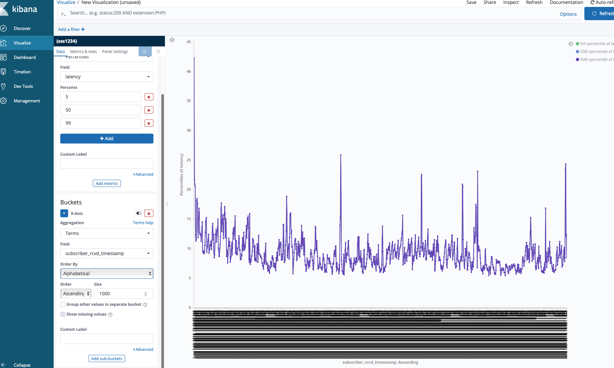
    
  With 10k 5%, 50% and 99% latency range:
    
   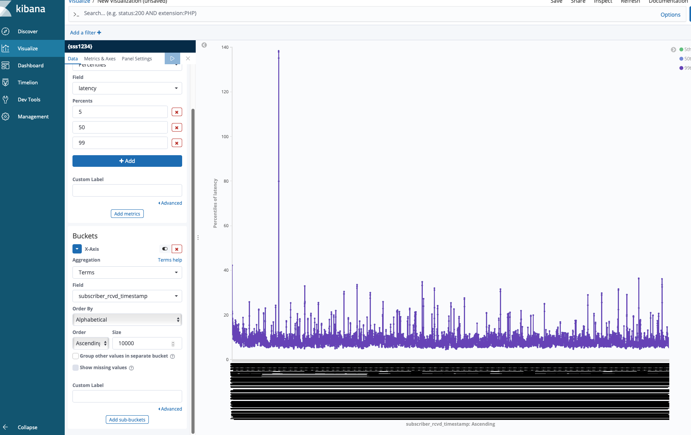
    
   

	Inference:
	----------
	1. CAMEL + KAFKA is really good and with 10k messages per second, it performs really well with 5-15 msec end-to-end latency.
	2. When we scale up the PUBLISHER and SUBSCRIBER pods, the thruput of the entire environment reduces because all these PODS are scheduled on two NODES (PUBLISHER and SUBSCRIBER Virtual Machines with 8 cores and with 8 GB RAM), the NODES are busy context switching between these PODS to service them. This causes reduction in thruput. But, the end-to-end latency is very low which tells us that the thruput problem is not a bottleneck on the broker rather on the producer and consumer PODS.
	3. With proper kafka clustering and with fine tuning, KAFKA with CAMEL is expected to perform well even with 100k messages per second with single digit millisecond end-to-end latency.

RABBITMQ + TRANSFORMER PODS:
----------------------------
Test Setup:
1. RabbitMQ broker POD - on "Broker" Node.

2. Queue Name: Auto generated by the ORCHESTRATOR POD. 

3. 1 PUBLISHER POD publishing 1000 messages per second to a queue assigned to it.

4. 1 CONSUMER POD subscribes to a queue assigned to it.

5. Single node RabbitMQ instance was tested with the following MQTT optimizations on the Kubernetes MEC cluster:

enabled_plugins: |
    [rabbitmq_management,rabbitmq_mqtt,rabbitmq_peer_discovery_k8s].
rabbitmq.conf: |

mqtt.tcp_listen_options.backlog = 8192

mqtt.tcp_listen_options.recbuf  = 131072

mqtt.tcp_listen_options.sndbuf  = 131072

mqtt.tcp_listen_options.keepalive = false

mqtt.tcp_listen_options.nodelay   = true

mqtt.tcp_listen_options.exit_on_close = true

mqtt.tcp_listen_options.send_timeout  = 120

mqtt.subscription_ttl = 86400000

mqtt.prefetch         = 0

	./make_deploy.sh deploy_core rabbitmq
	kubectl apply -f kubernetes_yaml_files/core_components/rabbitmq
	namespace/loadtest created
	deployment.extensions/orchestrator created
	deployment.extensions/publisher created
	serviceaccount/rabbitmq created
	role.rbac.authorization.k8s.io/endpoint-reader created
	rolebinding.rbac.authorization.k8s.io/endpoint-reader created
	service/rabbitmq created
	configmap/rabbitmq-config created
	statefulset.apps/rabbitmq created
	deployment.extensions/redis-commander created
	service/redis-commander created
	deployment.extensions/redis created
	service/redis created
	deployment.extensions/subscriber created
	deployment.extensions/transformer created

1. One instance of PUBLISHER that sends 1000 messages a second is tested with one instance of SUBSCRIBER and one instance of TRANSFORMER.

2. The PUBLISHER POD publishes 1000 messages to the queue. {'publisher': 'pub_publisher-7fc7cb9756-tgk4w'}

3. The SUBSCRIBER POD subscribes messages from the queue. {'subscriber': 'sub_subscriber-79b4bc4c9f-wstj6'}

4. The TRANSFORMER POD subscribes messages from queue {'publisher': 'pub_publisher-7fc7cb9756-tgk4w'} and publishes messages to queue  {'subscriber': 'sub_subscriber-79b4bc4c9f-wstj6'}

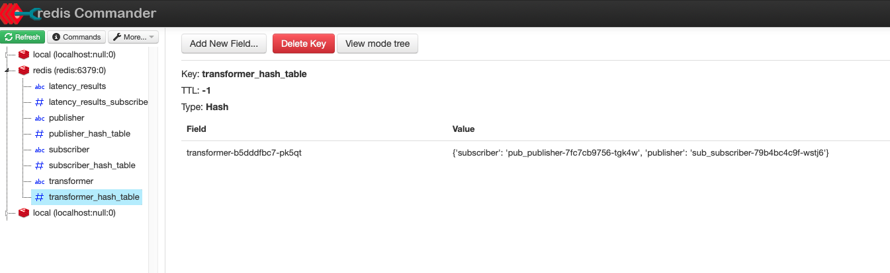

This is a snapshot of how RABBITMQ server views the incoming message rate onto the queue.

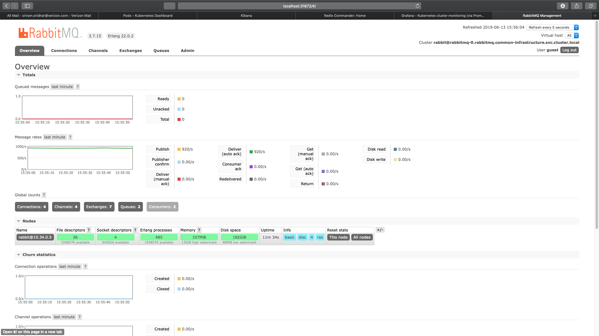

This is snapshot from Prometheus and Grafana on the RABBITMQ POD CPU and RAM utilization.

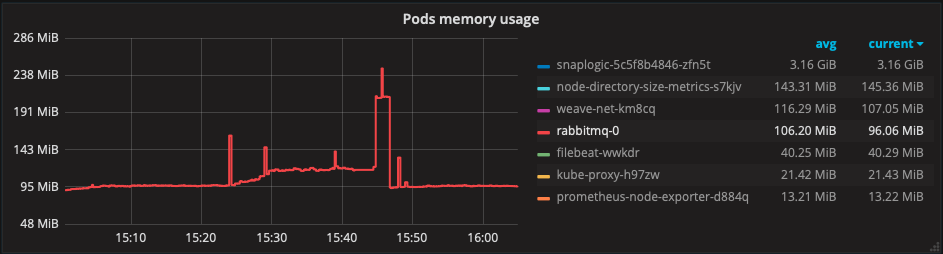

Latency results published by the SUBSCRIBER POD in its logs.

This is the latency result viewed from Redis Commander:

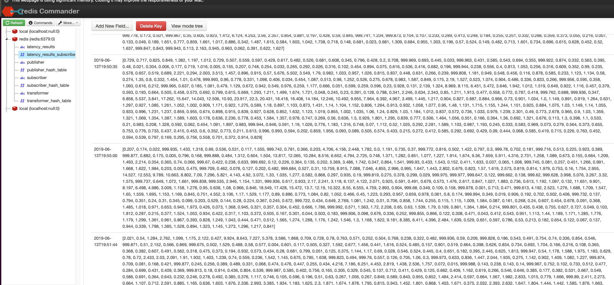

This latency result is published to ELK (Elasticsearch, Logstash and Kibana) via Filebeat and this is how the result is visualized in Kibana.

For a Larger Sample set with a lot of samples collected over a long period of time:

	./make_deploy.sh undeploy_core rabbitmq
	kubectl delete -f kubernetes_yaml_files/core_components/rabbitmq
	namespace "loadtest" deleted
	deployment.extensions "orchestrator" deleted
	deployment.extensions "publisher" deleted
	serviceaccount "rabbitmq" deleted
	role.rbac.authorization.k8s.io "endpoint-reader" deleted
	rolebinding.rbac.authorization.k8s.io "endpoint-reader" deleted
	service "rabbitmq" deleted
	configmap "rabbitmq-config" deleted
	statefulset.apps "rabbitmq" deleted
	deployment.extensions "redis-commander" deleted
	service "redis-commander" deleted
	deployment.extensions "redis" deleted
	service "redis" deleted
	deployment.extensions "subscriber" deleted
	deployment.extensions "transformer" deleted

	Inference:
	----------
	1. Single digit millisecond latency can be successfully achieved with RABBITMQ with one producer and one consumer queue with message rates unto 1000 messages per second.

	2. For message rates above 1000 messages a second from multiple producers and from multiple subscribers, RABBITMQ has to be deployed in a clustered way with multiple brokers sharing workload via consistent hashing. 

	3. This requires significant amount of effort and time to make it happen but it is doable and achievable.

	4. Right now, we are half way through this process of perfecting the broker configuration but since we are out of time, we are publishing the results only for the successful and proven scenario.

	5. Once we are able to perfect the correct broker deployment, we will be able to achieve higher thruput and single digit millisecond latency for 100k messages per second.

Apache Pulsar:
--------------
	./make_deploy.sh deploy_core pulsar
	kubectl apply -f kubernetes_yaml_files/core_components/pulsar
	namespace/loadtest created
	deployment.extensions/broker created
	service/broker created
	namespace/loadtest unchanged
	deployment.extensions/orchestrator created
	deployment.extensions/publisher created
	deployment.extensions/redis-commander created
	service/redis-commander created
	deployment.extensions/redis created
	service/redis created
	deployment.extensions/subscriber created
	deployment.extensions/transformer created

1. 100K messages were pushed by 100 PUBLISHER pods each to a unique queue.

2. 100 SUBSCRIBER PODS were configured to consume messages each from a unique queue identifier.
100 TRANSFORMER PODS were configured in such a way that it consumes message from a PUBLISHER pod and transform the message and publish it to a unique topic that gets consumed by a unique SUBSCRIBER pod.

Latency Results published to Redis Database and seen via Redis Commander:

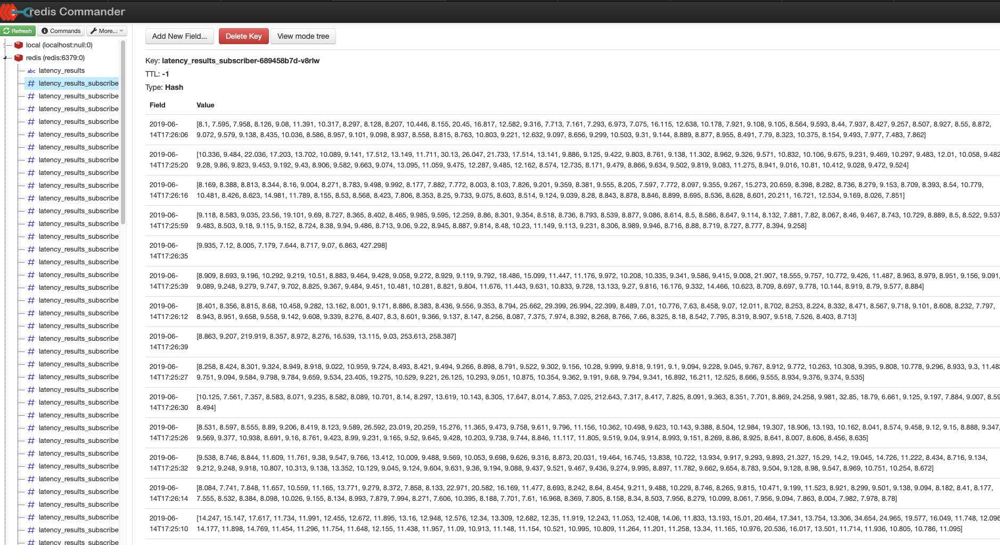

PUBLISHER NODE CPU and RAM Usage:

SUBSCRIBER NODE CPU and RAM Usage:

 BROKER NODE CPU and RAM Usage:
 
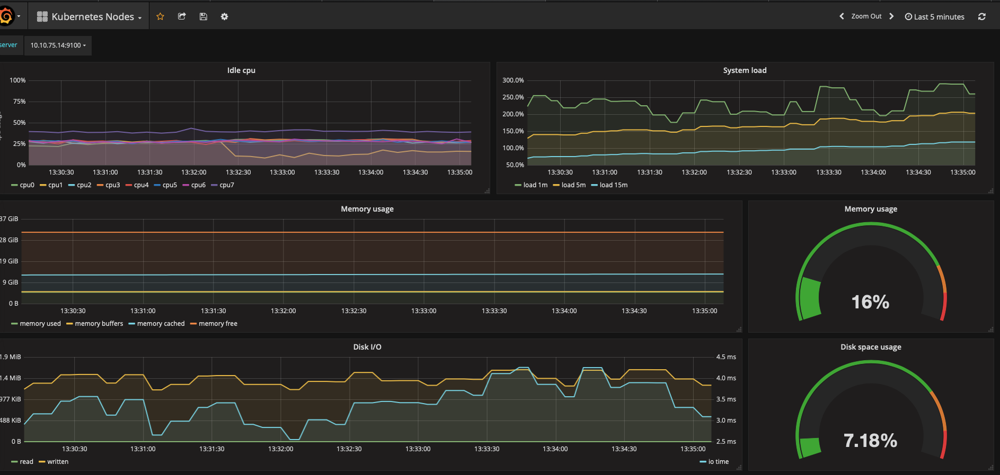
 
 Latency results vs original time.
 
 
 
	./make_deploy.sh undeploy_core pulsar
	kubectl delete -f kubernetes_yaml_files/core_components/pulsar
	namespace "loadtest" deleted
	deployment.extensions "broker" deleted
	service "broker" deleted
	deployment.extensions "orchestrator" deleted
	deployment.extensions "publisher" deleted
	deployment.extensions "redis-commander" deleted
	service "redis-commander" deleted
	deployment.extensions "redis" deleted
	service "redis" deleted
	deployment.extensions "subscriber" deleted
	deployment.extensions "transformer" deleted

	Inference:
	----------
	1. Pulsar provides much better thruput than KAFKA for 100k messages per second.

	2. Pulsar reaches a steady state latency of 9 msec after initial spikes which reached above 700-800 milliseconds.

	3. With proper clustering of Pulsar message queue and with proper configuration, it is expected to perform very well for 100k messages per second.
 
NATS
----
	./make_deploy.sh deploy_core nats
	kubectl apply -f kubernetes_yaml_files/core_components/nats
	namespace/loadtest created
	namespace/loadtest unchanged
	deployment.extensions/nats created
	service/nats created
	deployment.extensions/orchestrator created
	deployment.extensions/publisher created
	deployment.extensions/redis-commander created
	service/redis-commander created
	deployment.extensions/redis created
	service/redis created
	deployment.extensions/subscriber created
	deployment.extensions/transformer created

 
 
  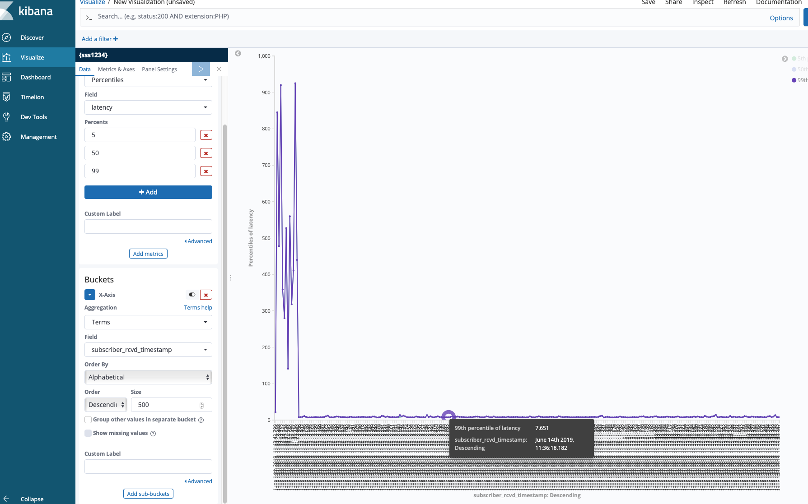
  
  PUBLISHER CPU+ MEM:
  
  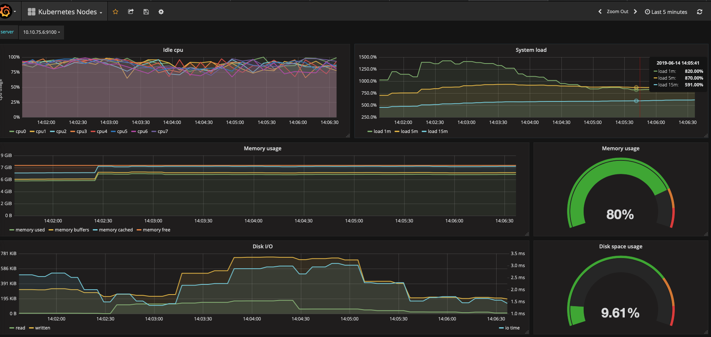
  
  SUBSCRIBER CPU + MEM:
  
  
  
  BROKER CPU + MEM:
  
  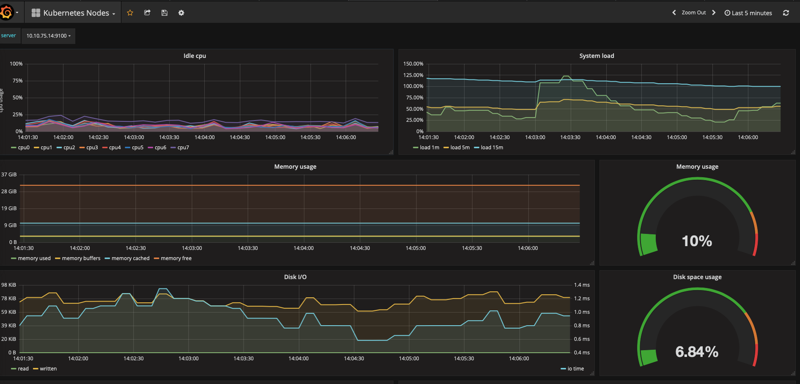
  
  	./make_deploy.sh undeploy_core nats
	kubectl delete -f kubernetes_yaml_files/core_components/nats
	namespace "loadtest" deleted
	deployment.extensions "nats" deleted
	service "nats" deleted
	deployment.extensions "orchestrator" deleted
	deployment.extensions "publisher" deleted
	deployment.extensions "redis-commander" deleted
	service "redis-commander" deleted
	deployment.extensions "redis" deleted
	service "redis" deleted
	deployment.extensions "subscriber" deleted
	deployment.extensions "transformer" deleted

ZeroMQ:
-------
	./make_deploy.sh deploy_core zeromq
	kubectl apply -f kubernetes_yaml_files/core_components/zeromq
	namespace/loadtest created
	deployment.extensions/orchestrator created
	deployment.extensions/publisher created
	service/publisher created
	deployment.extensions/redis-commander created
	service/redis-commander created
	deployment.extensions/redis created
	service/redis created
	deployment.extensions/subscriber created
	deployment.extensions/transformer created
	service/transformer created

 
 
 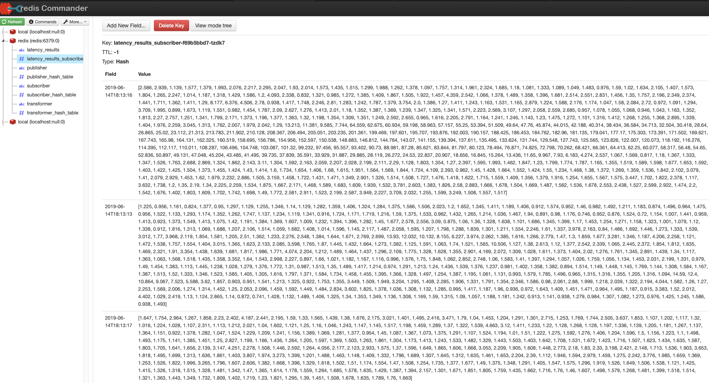
 
 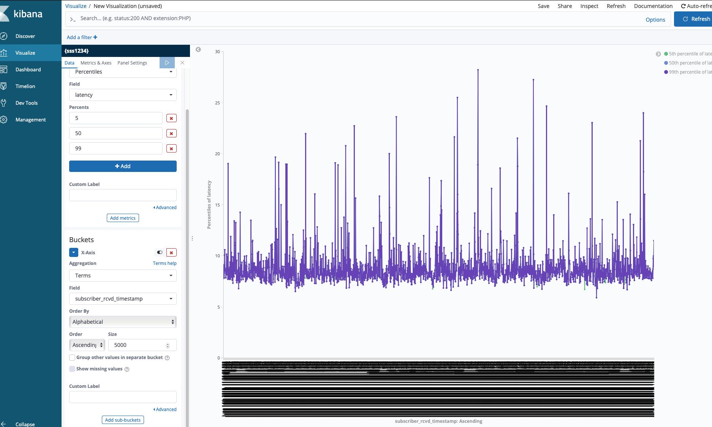
 
 	Inference:
	 ----------
	1. ZeroMQ has the best latency results for 100k messages per second because there is no broker and is peer-to-peer.

	2. A PRODUCER POD is tied up to a TRANSFORMER POD where the PRODUCER POD produces messages and sends it to a TRANSFORMER POD via its auto-configured IP address and PORT number.

	3. A SUBSCRIBER POD is tied up to a TRANSFORMER POD where the SUBSCRIBER  POD expects messages from a TRANSFORMER POD via its auto-configured IP address and PORT number.

	4. The TRANSFORMER POD is configured to consume messages from the PRODUCER POD and generate message to a SUBSCRIBER POD.
	5. This setup is scaled up to 100 PODS with one-to-one mapping of PRODUCER to TRANSFORMER to SUBSCRIBER pod.

	./make_deploy.sh undeploy_core zeromq
	kubectl delete -f kubernetes_yaml_files/core_components/zeromq
	namespace "loadtest" deleted
	deployment.extensions "orchestrator" deleted
	deployment.extensions "publisher" deleted
	service "publisher" deleted
	deployment.extensions "redis-commander" deleted
	service "redis-commander" deleted
	deployment.extensions "redis" deleted
	service "redis" deleted
	deployment.extensions "subscriber" deleted
	deployment.extensions "transformer" deleted
	service "transformer" deleted

EMQ
---
	./make_deploy.sh undeploy_core zeromq
	kubectl delete -f kubernetes_yaml_files/core_components/zeromq
	namespace "loadtest" deleted
	deployment.extensions "orchestrator" deleted
	deployment.extensions "publisher" deleted
	service "publisher" deleted
	deployment.extensions "redis-commander" deleted
	service "redis-commander" deleted
	deployment.extensions "redis" deleted
	service "redis" deleted
	deployment.extensions "subscriber" deleted
	deployment.extensions "transformer" deleted
	service "transformer" deleted

Latency Results of EMQ will be published soon.

	Inference:
	----------
1. EMQ performs much better and faster than RABBITMQ and EMQ supports MQTT.

2. EMQ requires a little bit of tuning and configuration changes to make it work with 100k messages per second and is expected to work well under heavy load. 

3. It is possible to achieve single digit end-to-end latency with EMQ.

		./make_deploy.sh undeploy_core emq
		kubectl delete -f kubernetes_yaml_files/core_components/emq
		namespace "loadtest" deleted
		service "emqx" deleted
		deployment.extensions "emqx" deleted
		deployment.extensions "orchestrator" deleted
		deployment.extensions "publisher" deleted
		deployment.extensions "redis-commander" deleted
		service "redis-commander" deleted
		deployment.extensions "redis" deleted
		service "redis" deleted
		deployment.extensions "subscriber" deleted
		deployment.extensions "transformer" deleted
